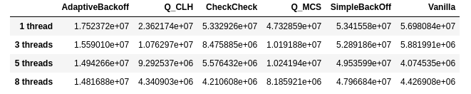
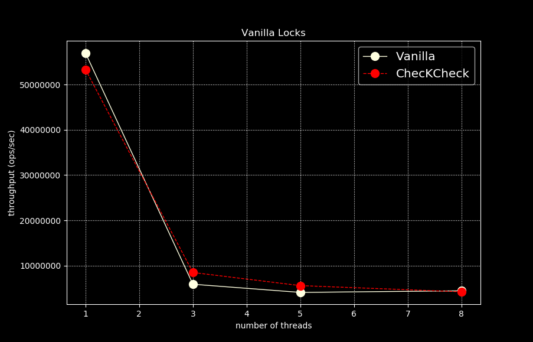
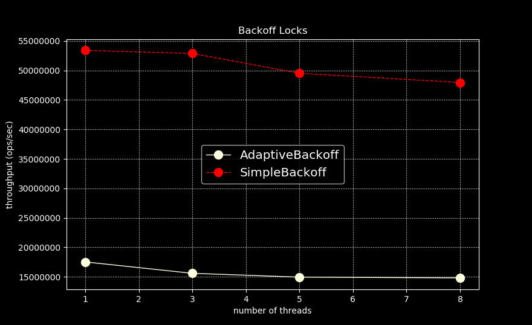
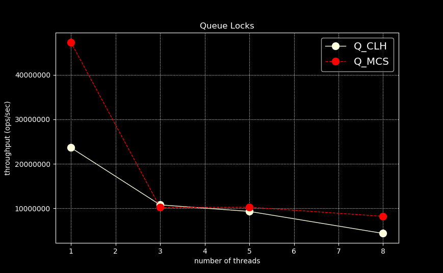

# j-concur
Java library for frequently used constructs on shared memory processor architectures. 

Comp architectural wisdom says single threaded pinned code runs faster than multi-threaded non deterministic code. But if running with multiple application threads in JVM is an inevitability, this library will keep us floating.

`This library uses JMH (Java Microbenchmarking Harness) for benchmarking and uses Python's capabilities to
present the numbers in intuitive ways. The folder 'inferences' contains Python Jupyter notebooks 
containing package specific rendering code and resulting image files which have been used on this 
landing page.` 
  
#### Spin Lock Performance in single versus multi-threaded setup

The spin locks provided by the library implement a general contract defined in the interface `ISpinLock`. 
Following concrete implementation classes are provided by the library:

- Vanilla locks (performing constant global spinning)
- Backoff based locks (performing occasional global spinning and timed backoffs)
- Queue based locks (using queue like structures to perform local spinning and guaranteeing lock fairness)

Here are some observations made in the following setup:

- JVM version: JDK 1.8.0_212, VM 25.212-b04
- Warmup: 20 iterations, 1 s each
- Measurement: 20 iterations, 1 s each
- Timeout: 10 min per iteration
- Benchmark mode: Throughput, ops/sec

Back-off based spin locks seem to work faster than other classes although they suffer from the 
limitation that they backoff for fixed or adaptive time durations which is not deterministic
and they are not fair as well.

 

Vanilla locks use ordinary optimistic spin locking to determine ownership and lock release 
which induces more cache coherence traffic among CPU cores. Moreover they are not fair.       

Queue based spin lock fall in the middle ground. They cause minimum amount of cache coherence
 traffic and are completely fair guaranteeing lock fairness and first-come-first-served ordering.
 

[ISpinLock]: java/spinlocks/ISpinLock